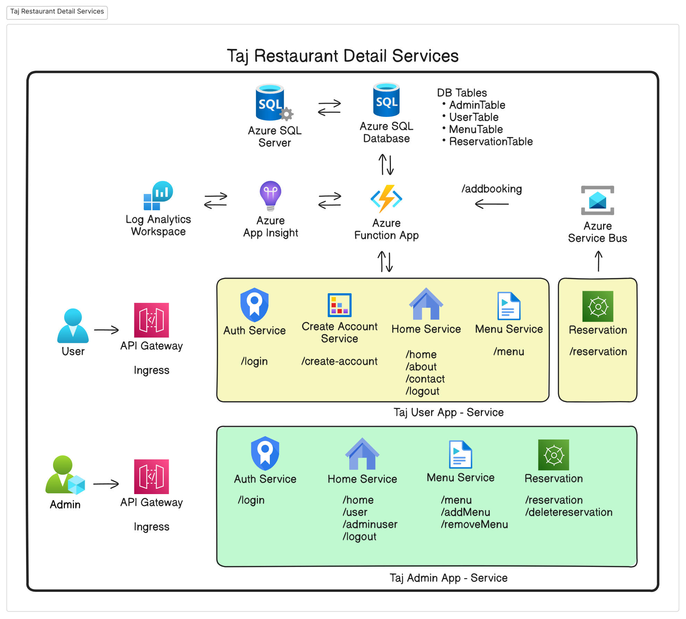
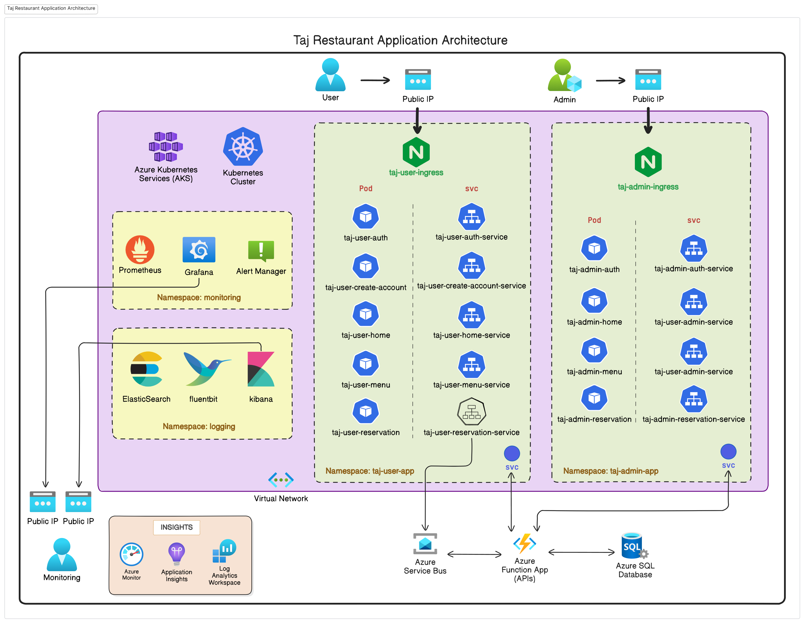
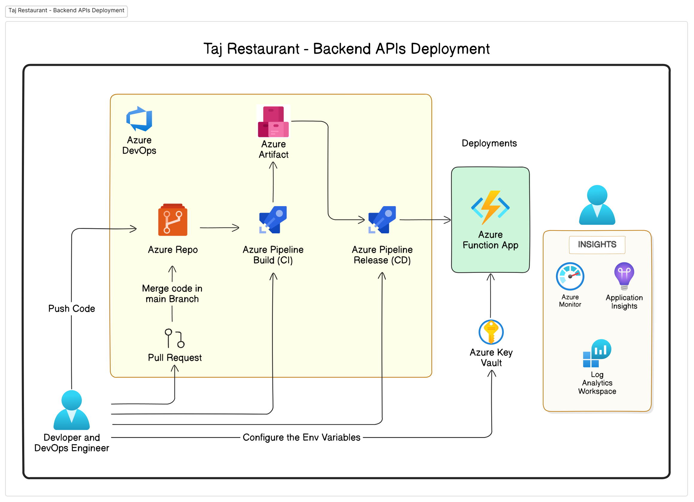
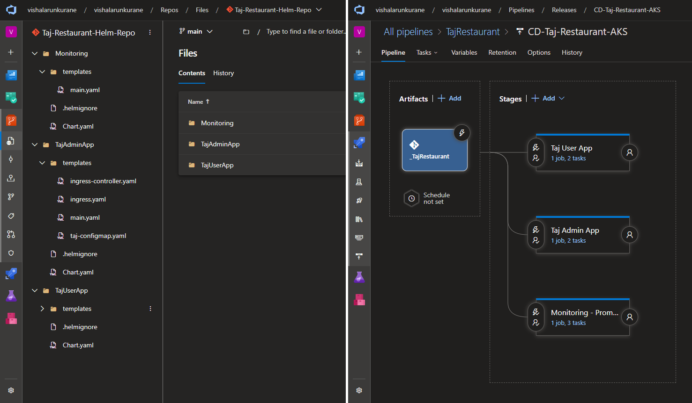
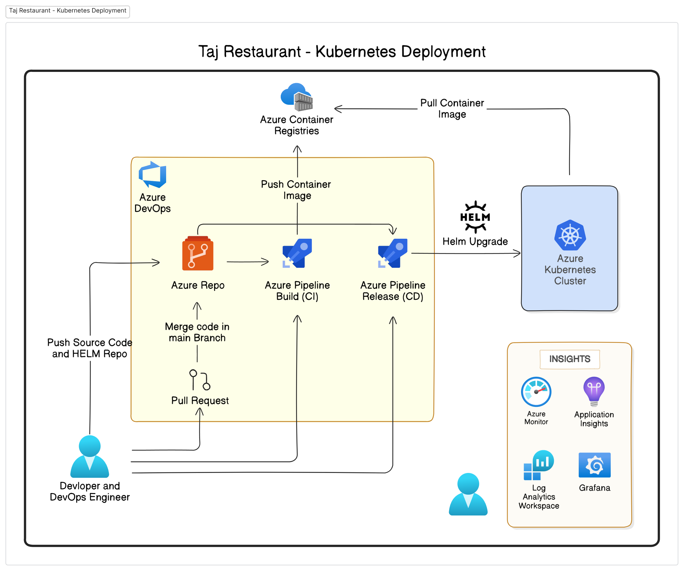

# Taj Restaurant App

<!-- ## Overview -->
The **Taj Restaurant App** is a microservice-based application designed for restaurant management. It comprises two main apps:
- **Taj-Admin-App**: For administrative tasks.
- **Taj-User-App**: For user-facing operations.

This repository contains all the necessary resources to deploy, monitor, and maintain the application using modern cloud technologies and best practices.

---

## 🧧 Application Architecture
The application architecture integrates modern cloud technologies and microservices principles. Key components include:
- **Microservices**:
  - **Taj-Admin-App**: 4 microservices for admin functionalities.
  - **Taj-User-App**: 5 microservices for user operations.
- **Azure SQL Database**: For relational data storage.
- **Azure Functions**: For API execution.
- **Azure Service Bus**: For event-driven and Asynchronous Communication.
- **Monitoring**: Implemented with Prometheus, Grafana, and Azure Application Insights.
- **Logging**: Implemented with EFK Satck (Elasticsearch, Fluentbit and Kibana)

### Taj-Restaurant-Detail-Services


### Taj-Restaurant-Application-Architecture



---

## 🚀 APIs - Folder

The APIs folder contains the source code for backend APIs, developed for an Azure Function App using **Python 3.11**. These APIs enable communication between the microservices and the Azure resources, providing core functionalities for the Taj Restaurant App.

### User App APIs

- **UserLogin** : This API validates the Username & Password and if the creds are valid generate and return a JWT token for authentication of User.
- **AddUser** : To add and register a new user.
- **GetMenu** : This API query the MenuTable and fetch the available menus.
- **AddBooking** : This API is used to make a entry of reservation details through Azure ServiceBus.
- **ValidateToken** : This API validate the JWT token befor accessing each route.

### Admin App APIs

- **AdmLogin** : This API validates the Username & Password and if the creds are valid generate and return a JWT token for authentication of Admin.
- **GetUser** : This API query the 'UserTable' and fetch the available Users.
- **GetAdmin** : This API query the 'AdminTable' and fetch the available Admins. (Not Configured)
- **GetMenu** : This API query the 'MenuTable' and fetch the available Menus.
- **GetBooking** : This API query the 'ReservationTable' and fetch the available Reservation Details.
- **AddAdmin** : To add and register a new Admin. (Not Configured)
- **AddMenu** : To add new Menu
- **DeleteUser** : To delete the existing User
- **DeleteMenu** : To delete the existing Menu
- **DeleteBooking** : To delete the existing Reservation
- **ValidateToken** : This API validate the JWT token befor accessing each route.

---
## 🎯 App - Folder

The App folder contains the source code for two microservice based applications, developed using Python Flask, along with their respective Dockerfiles for containerization.

- Taj-Admin-App:
  
  This app handles administrative functions for the restaurant, such as:
  - Adding and updating menu items.
  - Viewing and managing reservations.
  - Managing admin and user accounts.

- Taj-User-App:

  This app provides user-facing functionality, including:
  - Viewing the menu.
  - Making reservations.
  - Managing user profiles and authentication.


---
## 🛢️ Database - Folder

This folder contains the SQL files to create database tables and triggers.

### Below are the database tables and respective schema

### 🧮 UserTable
| userid | full_name | email | phone | password_hash | created_at | updated_at |
|--------|-----------|-------|-------|---------------|------------|------------|
|--------|-----------|-------|-------|---------------|------------|------------|

### 🧮 AdminTable
| admin_id | full_name | email | phone | password_hash | created_at | updated_at |
|----------|-----------|-------|-------|---------------|------------|------------|
|----------|-----------|-------|-------|---------------|------------|------------|

### 🧮 MenuTable
| menu_id | category | name | description | price | image_url |
|---------|----------|------|-------------|-------|-----------|
|---------|----------|------|-------------|-------|-----------|

### 🧮 ReservationTable
| reservation_id | user_email | guest_name | guest_email | guest_phone | checkin_date | checkin_time | no_of_guest | created_at | updated_at |
|----------------|------------|------------|-------------|-------------|--------------|--------------|-------------|------------|------------|
|---------------|-----------|------------|-------------|-------------|--------------|--------------|-------------|-----------|------------|

---

## 🏭 Terraform

Provision the Azure Infrastructure using below Terraform Source Code:
- [Azure Function App (Linux)](https://github.com/VishalKurane/Terraform/tree/main/Linux%20Function%20App)
- [Azure Application Insight](https://github.com/VishalKurane/Terraform/tree/main/Application%20Insight)
- [Azure ServiceBus Namespace](https://github.com/VishalKurane/Terraform/tree/main/Service%20Bus%20Namespace)
- [AKS Cluster](https://github.com/VishalKurane/Terraform/tree/main/AKS%20Cluster)
- Azure SQL Database: Provision the SQL Server and Database manualy so that you can user the Free Pricing tier. (First 100,000 vCore seconds and 32GB of storage free per month.)

---
## 📑 YAML Manifests - Folder

The **YAML Manifests** folder contains configuration files for deploying various resources and services in the AKS cluster. These manifests are designed for manual deployments and provide a comprehensive set of resources for managing application components, monitoring, and logging.


---
## ⚙ Helm Repositories - Folder

The **Helm Repo** folder contains Helm charts used for deploying various components of the Taj Restaurant App on an Azure Kubernetes Service (AKS) cluster. These charts are integrated with Azure DevOps pipelines to ensure seamless deployment and scalability of the application.

### Contents:
1. **Monitoring**:
   - Helm chart used to deploy **Ingress** and **Ingress Controller** to access the `Promethus` OR `Grafana` OR `Alert Manager`.
   - This chart needs to be deployed after deploying Monitoring Stack (Prometheus, Grafana and Alert.Manager)

2. **TajAdminApp**:
   - Helm chart used to deploy the **Taj Admin App** microservices on the AKS cluster.
   - Configured to automate deployment via Azure DevOps pipelines.

3. **TajUserApp**:
   - Helm chart used to deploy the **Taj User App** microservices on the AKS cluster.
   - Configured to automate deployment via Azure DevOps pipelines.

---

## 🎯 Backend APIs Deployment on Azure Function App

Clone the `/APIs`directory and deploy it on Azure function app manually or through Azure DevOps CI-CD Pipeline.

### Required Environment Variables:
To ensure proper functionality, the following environment variables must be configured in the Azure Function App:

1. **DBConnectionString**:
Connection string to the Azure SQL Database for accessing and managing the data stored in tables such as AdminTable, UserTable, MenuTable, and ReservationTable.

2. **JWT_SECRET_KEY**:
A random, strong and unique value string used for signing and verifying JWT (JSON Web Tokens). This key ensures the security and integrity of the tokens used for authentication.

3. **ServiceBusConnectionString**:
Connection string of the Azure Service Bus Namespace for managing asynchronous communication, for handling reservation messages.

4. **ReservationQueueName**:
Queue name of Service Bus Namespace for managing asynchronous communication, for handling reservation messages.

5. **APPINSIGHTS_INSTRUMENTATIONKEY**:
Instrumentation key for integrating with Azure Application Insights, enabling performance monitoring and logging for debugging and diagnostics.

**Note:** Post deployment configure the generated function URLs to respective environment variables in ConfigMap.

### Taj-Restaurant-Backend-APIs-Deployment



---

## ☸️ Taj-Restaurant App Deployment on Azure Kubernetes Cluster

### 📜 *EFK Stack Deployment (Elasticsearch, Fluentbit, Kibana)*

- Create a "logging" namespace in AKS cluster:

  ```bash
  kubectl create ns logging
  ```

- Add the Elastic Helm repository:

  ```bash
  helm repo add elastic https://helm.elastic.co
  helm repo update
  ```

- Install **Elastic Search** using Helm:

  ```bash
  helm install elasticsearch elastic/elasticsearch \
    --set replicas=1 \
    --set persistence.enabled=true \
    --set volumeClaimTemplate.resources.requests.storage=10Gi -n logging
  ```
  - This command will install the elastic search with the default 'storage class' in AKS cluster.
  - An Azure Disk will get created in 'Infrastructure Resource Group' as 'Persistent Volume Claim' with 10 Gb of storage through the default CNI drivers.
  - You can also create custom storage class (azureshare)

- Retrieve Elasticsearch Username & Password

  ```bash
  # For username of Elasticsearch
  kubectl get secrets --namespace=logging elasticsearch-master-credentials -ojsonpath='{.data.username}' | base64 -d

  # For password of Elasticsearch
  kubectl get secrets --namespace=logging elasticsearch-master-credentials -ojsonpath='{.data.password}' | base64 -d
  ```
  - The password of elasticsearch needs to be updated in fluentbit-values.yaml
  - With same Username and Password we need to access the Kibana.


- Install **Fluentbit** using Helm and Custom values.yaml file:
  
  Download the `/Yaml Manifests/EFK Stack/fluent-bit-values.yaml` file and update the `HTTP_Passwd` field in the `fluentbit-values.yaml` file with the password retrieved earlier after installing Elasticsearch. This will allow the fluentbit to push log data to elastic search.

  ```bash
  helm repo add fluent https://fluent.github.io/helm-charts
  helm install fluent-bit fluent/fluent-bit -f fluent-bit-values.yaml -n logging
  ```

- Install Kibana using Helm:
  ```bash
  helm install kibana --set service.type=LoadBalancer elastic/kibana -n logging
  ```
  - Defining service type as LoadBalancer so that we can access the 'Kibana' using Public IP.

- Get the Public IP address of Kibana Service:
  ```bash
  kubectl get all -n logging
  ```

### 📊 *Monitoring Stack Deployment (Prometheus, Grafana and Alert Manager)*

- Create a "monitoring" namespace in AKS cluster:
  ```bash
  kubectl create ns monitoring
  ```

- To deploy the Promethus, Grafana and Alert Manager using Helm Chart through Azure DevOps Release Pipeline, clone the Helm Repo (/Helm Repos/Monitoring) to Azure DevOps Repo. This contains the template to deploy the **Ingress** and **Nginx Ingress Controller** to access the `Promethus` OR `Grafana` OR `Alert Manager` using Publc IP.



- Create a Release Pipeline with 'Stage' `Monitoring - Promethus and Grafana` containing below tasks:
  - Task 1: Install Helm

  - Task 2: Helm Install "kube-prometheus-stack" Chart
    - Namespace: monitoring
    - Command: install
    - Chart Type: Name
    - Chart Name: kube-prometheus-stack
    - Release Name: taj-monitoring-release
    - Arguments: --repo https://prometheus-community.github.io/helm-charts

  - Task 2: Helm Install "Ingress and Controller" Chart
    - Namespace: monitoring
    - Command: upgrade
    - Chart Type: File Path
    - Chart Path: $(System.DefaultWorkingDirectory)/_TajRestaurant/Monitoring
    - Release Name: taj-monitoring-ingress-release

- Get the Public IP address of Ingress to access Grafana:
  ```bash
  kubectl get ingress -n monitoring
  ```

### 👩🏻‍💻 *Taj User App Deployment*

- To deploy the `Taj User App` using Helm Chart through Azure DevOps Release Pipeline, clone the Helm Repo (/Helm Repos/TajUserApp) to Azure DevOps Repo.

- Create a Release Pipeline with 'Stage' `Taj User App` containing below tasks:
  - Task 1: Install Helm

  - Task 2: Helm Upgrade - Deploy Taj User App
    - Command: upgrade
    - Chart Type: File Path
    - Chart Path: $(System.DefaultWorkingDirectory)/_TajRestaurant/TajUserApp
    - Release Name: taj-user-app-release

- Get the Public IP address of Ingress to access Taj-User-App:
  ```bash
  kubectl get ingress -n taj-user-app
  ```

### 🛡️  *Taj Admin App Deployment*

- To deploy the `Taj Admin App` using Helm Chart through Azure DevOps Release Pipeline, clone the Helm Repo (/Helm Repos/TajUserApp) to Azure DevOps Repo.

- Create a Release Pipeline with 'Stage' `Taj Admin App` containing below tasks:
  - Task 1: Install Helm

  - Task 2: Helm Upgrade - Deploy Taj User App
    - Command: upgrade
    - Chart Type: File Path
    - Chart Path: $(System.DefaultWorkingDirectory)/_TajRestaurant/TajAdminApp
    - Release Name: taj-admin-app-release

- Get the Public IP address of Ingress to access Taj-Admin-App:
  ```bash
  kubectl get ingress -n taj-admin-app
  ```

---

<!-- ### Taj-Restaurant-Kubernetes-Deployment -->



---

## Basic PromQL Queries

-  ### CPU Percentage:
    ```bash
    100 * sum(rate(container_cpu_usage_seconds_total[5m])) / sum(machine_cpu_cores)
    ```

- ### Memory usage percentage:
    ```bash
    100 * sum(container_memory_usage_bytes) / sum(node_memory_MemTotal_bytes)
    ```

- ### CPU Usage per Instance
    ```bash
    avg by (instance) (rate(node_cpu_seconds_total[1m]))
    ```

- ### Memory Usage per Instance
    ```bash
    sum by (instance) (node_memory_MemTotal_bytes - node_memory_MemAvailable_bytes)
    ```

- ### Pod CPU Usage in a Namespace:
    ```bash
    sum(rate(container_cpu_usage_seconds_total{namespace="taj-admin-app"}[5m])) by (pod)
    sum(rate(container_cpu_usage_seconds_total{namespace="taj-user-app"}[5m])) by (pod)
    sum(rate(container_cpu_usage_seconds_total{namespace="logging"}[5m])) by (pod)
    sum(rate(container_cpu_usage_seconds_total{namespace="monitoring"}[5m])) by (pod)
    ```

- ### Pod Restarts in a Namespace
    ```bash
    sum(kube_pod_container_status_restarts_total{namespace="taj-admin-app"}) by (pod)
    sum(kube_pod_container_status_restarts_total{namespace="taj-user-app"}) by (pod)
    sum(kube_pod_container_status_restarts_total{namespace="logging"}) by (pod)
    sum(kube_pod_container_status_restarts_total{namespace="monitoring"}) by (pod)
    ```


- ### Counts the number of running pods in the namespace:
    ```bash
    count(kube_pod_status_phase{namespace="taj-admin-app", phase="Running"})
    count(kube_pod_status_phase{namespace="taj-user-app", phase="Running"})
    count(kube_pod_status_phase{namespace="logging", phase="Running"})
    count(kube_pod_status_phase{namespace="monitoring", phase="Running"})
    ```


- ### Tracks incoming network traffic for pods in the namespace.
    ```bash
    sum(rate(container_network_receive_bytes_total{namespace="taj-admin-app"}[5m])) by (pod)
    sum(rate(container_network_receive_bytes_total{namespace="taj-user-app"}[5m])) by (pod)
    sum(rate(container_network_receive_bytes_total{namespace="logging"}[5m])) by (pod)
    sum(rate(container_network_receive_bytes_total{namespace="monitoring"}[5m])) by (pod)
    ```


- ### Tracks outgoing network traffic for pods in the namespace.
    ```bash
    sum(rate(container_network_transmit_bytes_total{namespace="taj-admin-app"}[5m])) by (pod)
    sum(rate(container_network_transmit_bytes_total{namespace="taj-user-app"}[5m])) by (pod)
    sum(rate(container_network_transmit_bytes_total{namespace="logging"}[5m])) by (pod)
    sum(rate(container_network_transmit_bytes_total{namespace="monitoring"}[5m])) by (pod)
    ```

---